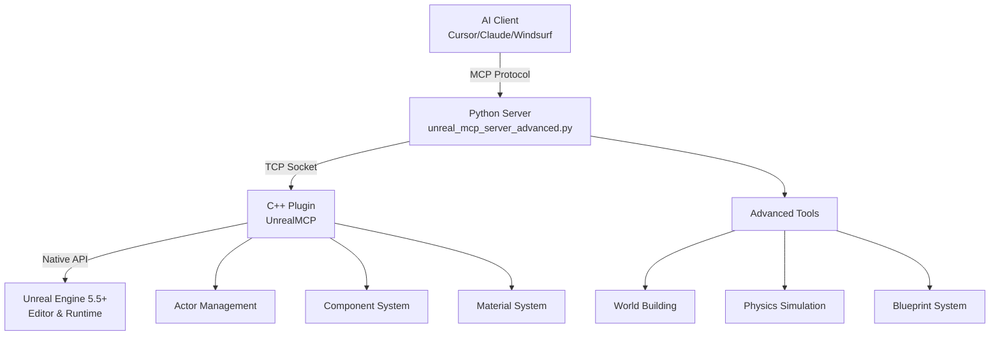

# The Most Advanced MCP Server for Unreal Engine

[](https://www.unrealengine.com/)
[](https://youtube.com/@flopperam)
[](https://discord.gg/3KNkke3rnH)
[](https://twitter.com/Flopperam)
[](https://tiktok.com/@flopperam)

**Control Unreal Engine 5.5+ through AI with natural language. Build incredible 3D worlds and architectural masterpieces using MCP. Create entire towns, medieval castles, modern mansions, challenging mazes, and complex structures with AI-powered commands.**

> **Active Development**: This project is under very active development with consistent updates, new features, and improvements being added regularly. Join our [Discord](https://discord.gg/3KNkke3rnH) to stay updated on the latest releases!

## 🎬 See It In Action
Watch our comprehensive tutorial for complete setup and usage:
- **[Complete MCP Tutorial & Installation Guide](https://youtu.be/ct5dNJC-Hx4)** - Full walkthrough of installation, setup, and advanced usage

Check out these examples of the MCP server in action on our channel:
- **[GPT-5 vs Claude](https://youtube.com/shorts/xgoJ4d3d4-4)** - Watch Claude and GPT-5 go head-to-head building simultaneously - Claude creates a massive fortress while GPT-5 builds a sprawling city
- **[Advanced Metropolis Generation](https://youtube.com/shorts/6WkxCQXbCWk)** - Watch AI generate a full-blown metropolis with towers, streets, parks, and over 4,000 objects from a single prompt
- **[Advanced Maze & Mansion Generation](https://youtube.com/shorts/ArExYGpIZwI)** - Watch Claude generate a playable maze and complete mansion complex with wings, towers, and arches

## Featured Capabilities

```bash
# Create a massive futuristic city with skyscrapers, flying cars, and advanced infrastructure
> "Build a massive futuristic city with towering skyscrapers"
→ create_town(town_size="massive", architectural_style="futuristic", building_density=0.95, include_advanced_features=true)
```

### Advanced Structures  
```bash
# Build complex multi-room houses with windows, doors, and roofs
> "Create a Victorian mansion complex with east and west wing houses."
→ construct_house(house_style="mansion", width=1500, height=900)
```

### Intelligent Mazes
```bash
# Generate solvable mazes with guaranteed paths using recursive backtracking
> "Make a 15x15 maze with high walls"
→ create_maze(rows=15, cols=15, wall_height=4, cell_size=250)
```

---

## Complete Tool Arsenal

| **Category** | **Tools** | **Description** |
|--------------|-----------|-----------------|
| **World Building** | `create_town`, `construct_house`, `construct_mansion`, `create_tower`, `create_arch`, `create_staircase` | Build complex architectural structures and entire settlements |
| **Epic Structures** | `create_castle_fortress`, `create_suspension_bridge`, `create_aqueduct` | Massive engineering marvels and medieval fortresses |
| **Level Design** | `create_maze`, `create_pyramid`, `create_wall` | Design challenging game levels and puzzles |
| **Physics & Materials** | `spawn_physics_blueprint_actor`, `set_physics_properties`, `get_available_materials`, `apply_material_to_actor`, `apply_material_to_blueprint`, `set_mesh_material_color` | Create realistic physics simulations and material systems |
| **Blueprint System** | `create_blueprint`, `compile_blueprint`, `add_component_to_blueprint`, `set_static_mesh_properties` | Visual scripting and custom actor creation |
| **Actor Management** | `get_actors_in_level`, `find_actors_by_name`, `delete_actor`, `set_actor_transform`, `get_actor_material_info` | Precise control over scene objects and inspection |

---

## ⚡ Lightning-Fast Setup

### Prerequisites
- **Unreal Engine 5.5+**
- **Python 3.12+**
- **MCP Client** (Claude Desktop, Cursor, or Windsurf)

### macOS Installation Guide

If you're on macOS and Unreal Engine fails to open the project due to compilation errors, you'll need to manually compile the C++ plugin first.

#### Step 1: Check Your Xcode Version

```bash
xcodebuild -version
xcrun --show-sdk-version
```

Note your Xcode version number (e.g., `26.0.1`, `16.0`, `15.2`, etc.). If your version is newer than 16.0, you'll need to patch the Unreal Engine SDK configuration.

#### Step 2: Patch Unreal Engine SDK Configuration

Edit the file at your Unreal Engine installation (replace `UE_5.X` with your version):

```bash
# Path to edit:
/Users/Shared/Epic Games/UE_5.X/Engine/Config/Apple/Apple_SDK.json
```

Update the following values:

**Change 1:** Update `MaxVersion` to support your Xcode version
```json
{
  "MaxVersion": "YOUR_XCODE_VERSION.9.0",  // e.g., "26.9.0" if you have Xcode 26.x
}
```
Replace `YOUR_XCODE_VERSION` with your major Xcode version from Step 1.

**Change 2:** Add LLVM version mapping for your Xcode version (add to the `AppleVersionToLLVMVersions` array)
```json
{
  "AppleVersionToLLVMVersions": [
    "14.0.0-14.0.0",
    "14.0.3-15.0.0",
    "15.0.0-16.0.0",
    "16.0.0-17.0.6",
    "16.3.0-19.1.4",
    "YOUR_XCODE_VERSION.0.0-19.1.4"  // e.g., "26.0.0-19.1.4" for Xcode 26.x
  ]
}
```
Replace `YOUR_XCODE_VERSION` with your major Xcode version from Step 1.

#### Step 3: Compile the Plugin

Run the Unreal Build Tool to compile the project:

```bash
"/Users/Shared/Epic Games/UE_5.X/Engine/Build/BatchFiles/Mac/Build.sh" \
  UnrealEditor Mac Development \
  -Project="/path/to/unreal-engine-mcp/FlopperamUnrealMCP/FlopperamUnrealMCP.uproject" \
  -WaitMutex
```

Replace:
- `UE_5.X` with your Unreal Engine version (e.g., `UE_5.6`)
- `/path/to/unreal-engine-mcp/` with the actual path to your cloned repository

The compilation should complete in ~30-60 seconds. You'll see output like:
```
Result: Succeeded
Total execution time: XX.XX seconds
```

#### Step 4: Continue with Setup Options

Once compilation succeeds, proceed with one of the setup options below.

---

### 1. Setup Options

**Option A: Use the Pre-Built Project (Recommended for Quick Start)**
```bash
# Clone the repository
git clone https://github.com/flopperam/unreal-engine-mcp.git
cd unreal-engine-mcp

# Open the pre-configured project
# Double-click FlopperamUnrealMCP/FlopperamUnrealMCP.uproject
# or open it through Unreal Engine launcher

# The plugin is already installed and enabled!
```

**Option B: Add Plugin to Your Existing Project**
```bash
# Copy the plugin to your project
cp -r UnrealMCP/ YourProject/Plugins/

# Enable in Unreal Editor
Edit → Plugins → Search "UnrealMCP" → Enable → Restart Editor
```

**Option C: Install for All Projects**
```bash
# Copy to Engine plugins folder (available to all projects)
cp -r UnrealMCP/ "C:/Program Files/Epic Games/UE_5.5/Engine/Plugins/"

# Enable in any project through the Plugin Browser
Edit → Plugins → Search "UnrealMCP" → Enable
```

### 2. Launch the MCP Server

```bash
cd Python
uv run unreal_mcp_server_advanced.py
```

### 3. Configure Your AI Client

Add this to your MCP configuration:

**Cursor**: `.cursor/mcp.json`
**Claude Desktop**: `~/.config/claude-desktop/mcp.json`
**Windsurf**: `~/.config/windsurf/mcp.json`

```json
{
  "mcpServers": {
    "unrealMCP": {
      "command": "uv",
      "args": [
        "--directory",
        "/path/to/unreal-engine-mcp/Python",
        "run",
        "unreal_mcp_server_advanced.py"
      ]
    }
  }
}
```

> **⚠️ Having issues with setup?** Check our [Debugging & Troubleshooting Guide](DEBUGGING.md) for solutions to common problems like MCP installation errors and configuration issues.

### Recommended AI Model

**We strongly recommend using Claude for the best experience.**

Claude has proven to be the most effective AI model for:
- Understanding complex 3D spatial relationships
- Generating accurate MCP tool calls
- Following architectural and physics constraints
- Creating coherent multi-step building processes

### Enhanced Accuracy with Rules

For improved results, especially when creating specific types of objects, provide the AI with our curated rules:

- **`.cursor/rules/`** - Contains specialized guides for different creation tasks

### 4. Start Building!

```bash
> "Create a medieval castle with towers and walls"
> "Generate a town square with fountain and buildings"
> "Make a challenging maze for players to solve"
```

---

## Architecture



**Performance**: Native C++ plugin ensures minimal latency for real-time control
**Reliability**: Robust TCP communication with automatic reconnection
**Flexibility**: Full access to Unreal's actor, component, and Blueprint systems

---

## Community & Support

**Join our community and get help building amazing worlds!**

### Connect With Us
- **YouTube**: [youtube.com/@flopperam](https://youtube.com/@flopperam) - Tutorials, showcases, and development updates
- **Discord**: [discord.gg/8yr1RBv](https://discord.gg/3KNkke3rnH) - Get help, share creations, and discuss the plugin
- **Twitter/X**: [twitter.com/Flopperam](https://twitter.com/Flopperam) - Latest news and quick updates  
- **TikTok**: [tiktok.com/@flopperam](https://tiktok.com/@flopperam) - Quick tips and amazing builds

### Get Help & Share
- **Setup Issues?** Check our [Debugging & Troubleshooting Guide](DEBUGGING.md) first
- **Questions?** Ask in our Discord server for real-time support
- **Bug reports?** Open an issue on GitHub with reproduction steps
- **Feature ideas?** Join the discussion in our community channels

---

## License
MIT License - Build amazing things freely.
