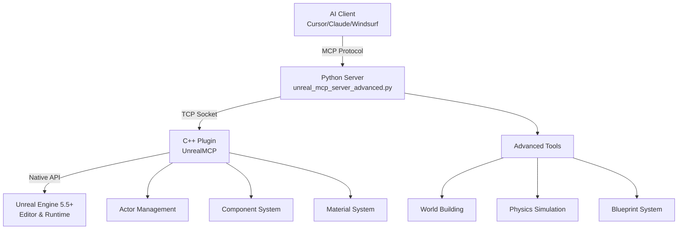

# The Flopperam Agent for Unreal Engine

**The world's first fully autonomous AI agent for Unreal Engine** — capable of building anything from complete 3D scenes to complex architectural structures, now with integrated **Microsoft Trellis** support for generating custom 3D assets on demand.

## Create Any 3D Asset with Microsoft Trellis Integration

The agent now seamlessly integrates with **Microsoft Trellis** to generate custom 3D models from text or images. Simply describe what you need, and the agent will generate the asset and place it directly in your Unreal scene.


*Generate photorealistic animals, vehicles, or any object you can imagine — the agent creates the 3D model and imports it into your scene automatically*

### What Makes This Revolutionary

- **Fully Autonomous**: The agent reasons through complex building tasks end-to-end
- **Custom 3D Assets**: Generate any 3D model on-demand using Microsoft Trellis
- **Smart Architecture**: Automatically determines materials, physics, and spatial relationships  
- **Clean Agent UI**: Watch the agent work in real-time with clear reasoning steps
- **All Building Workflows**: Cities, mansions, bridges, and more

**Try the agent today:** [https://flopperam.com/](https://flopperam.com/)

---

# The Most Advanced MCP Server for Unreal Engine

[](https://www.unrealengine.com/)
[](https://youtube.com/@flopperam)
[](https://discord.gg/3KNkke3rnH)
[](https://twitter.com/Flopperam)
[](https://tiktok.com/@flopperam)

**Control Unreal Engine 5.5+ through AI with natural language. Build incredible 3D worlds and architectural masterpieces using MCP. Create entire towns, medieval castles, modern mansions, challenging mazes, and complex structures with AI-powered commands.**

> **Active Development**: This project is under very active development with consistent updates, new features, and improvements being added regularly. Join our [Discord](https://discord.gg/3KNkke3rnH) to stay updated on the latest releases!

## See It In Action
Watch our comprehensive tutorial for complete setup and usage:
- **[Complete MCP Tutorial & Installation Guide](https://youtu.be/ct5dNJC-Hx4)** - Full walkthrough of installation, setup, and advanced usage

Check out these examples of the MCP server in action on our channel:
- **[GPT-5 vs Claude](https://youtube.com/shorts/xgoJ4d3d4-4)** - Watch Claude and GPT-5 go head-to-head building simultaneously - Claude creates a massive fortress while GPT-5 builds a sprawling city
- **[Advanced Metropolis Generation](https://youtube.com/shorts/6WkxCQXbCWk)** - Watch AI generate a full-blown metropolis with towers, streets, parks, and over 4,000 objects from a single prompt
- **[Advanced Maze & Mansion Generation](https://youtube.com/shorts/ArExYGpIZwI)** - Watch Claude generate a playable maze and complete mansion complex with wings, towers, and arches

## Featured Capabilities

### Complete Blueprint Visual Scripting

**Program Blueprints entirely through AI** with comprehensive node creation, graph management, and variable systems.

```bash
# Create complex Blueprint logic with control flow, variables, and functions
> "Create a Blueprint with a health system that tracks damage and triggers a death event"
→ create_blueprint() + create_variable() + add_node() + connect_nodes()

# Support for 23+ node types across 6 categories:
# Control Flow: Branch, Comparison, Switch (Byte/Enum/Integer), ExecutionSequence
# Data: VariableGet, VariableSet, MakeArray
# Casting: DynamicCast, ClassDynamicCast, CastByteToEnum
# Utility: Print, CallFunction, Select, SpawnActor
# Specialized: Timeline, GetDataTableRow, AddComponentByClass, Self, Knot
# Animation: PlayAnimation, StopAnimation, Timeline nodes
```

**Advanced Blueprint Features:**
- **Function Management**: Create custom functions with inputs/outputs, rename, and delete
- **Variable System**: Full property control (public/private, replication, tooltips, ranges, units)
- **Node Properties**: Dynamic pin management, type modification, semantic editing
- **Graph Analysis**: Read complete Blueprint content, analyze execution flow, inspect variables
- **Connection System**: Wire nodes together with automatic type validation

### World Building & Architecture  
```bash
# Create massive futuristic cities with skyscrapers, flying cars, and advanced infrastructure
> "Build a massive futuristic city with towering skyscrapers"
→ create_town(town_size="massive", architectural_style="futuristic", building_density=0.95)

# Build complex multi-room houses with windows, doors, and roofs
> "Create a Victorian mansion complex with east and west wing houses."
→ construct_house(house_style="mansion", width=1500, height=900)
```

### Intelligent Mazes
```bash
# Generate solvable mazes with guaranteed paths using recursive backtracking
> "Make a 15x15 maze with high walls"
→ create_maze(rows=15, cols=15, wall_height=4, cell_size=250)
```

---

## Complete Tool Arsenal

| **Category** | **Tools** | **Description** |
|--------------|-----------|-----------------|
| **Blueprint Visual Scripting** | `add_node`, `connect_nodes`, `delete_node`, `set_node_property`, `create_variable`, `set_blueprint_variable_properties`, `create_function`, `add_function_input`, `add_function_output`, `delete_function`, `rename_function` | Complete Blueprint programming with 23+ node types, variables with full property control, custom functions, and dynamic graph management |
| **Blueprint Analysis** | `read_blueprint_content`, `analyze_blueprint_graph`, `get_blueprint_variable_details`, `get_blueprint_function_details` | Deep inspection of Blueprint structure, event graphs, execution flow, variables, and functions |
| **World Building** | `create_town`, `construct_house`, `construct_mansion`, `create_tower`, `create_arch`, `create_staircase` | Build complex architectural structures and entire settlements |
| **Epic Structures** | `create_castle_fortress`, `create_suspension_bridge`, `create_aqueduct` | Massive engineering marvels and medieval fortresses |
| **Level Design** | `create_maze`, `create_pyramid`, `create_wall` | Design challenging game levels and puzzles |
| **Physics & Materials** | `spawn_physics_blueprint_actor`, `set_physics_properties`, `get_available_materials`, `apply_material_to_actor`, `apply_material_to_blueprint`, `set_mesh_material_color` | Create realistic physics simulations and material systems |
| **Blueprint System** | `create_blueprint`, `compile_blueprint`, `add_component_to_blueprint`, `set_static_mesh_properties` | Visual scripting and custom actor creation |
| **Actor Management** | `get_actors_in_level`, `find_actors_by_name`, `delete_actor`, `set_actor_transform`, `get_actor_material_info` | Precise control over scene objects and inspection |

---

## Lightning-Fast Setup

### Prerequisites
- **Unreal Engine 5.5+** 
- **Python 3.12+**
- **MCP Client** (Claude Desktop, Cursor, or Windsurf)

### 1. Setup Options

**Option A: Use the Pre-Built Project (Recommended for Quick Start)**
```bash
# Clone the repository
git clone https://github.com/flopperam/unreal-engine-mcp.git
cd unreal-engine-mcp

# Open the pre-configured project
# Double-click FlopperamUnrealMCP/FlopperamUnrealMCP.uproject
# or open it through Unreal Engine launcher

# The plugin is already installed and enabled!
```

**Option B: Add Plugin to Your Existing Project**
```bash
# Copy the plugin to your project
cp -r UnrealMCP/ YourProject/Plugins/

# Enable in Unreal Editor
Edit → Plugins → Search "UnrealMCP" → Enable → Restart Editor
```

**Option C: Install for All Projects**
```bash
# Copy to Engine plugins folder (available to all projects)
cp -r UnrealMCP/ "C:/Program Files/Epic Games/UE_5.5/Engine/Plugins/"

# Enable in any project through the Plugin Browser
Edit → Plugins → Search "UnrealMCP" → Enable
```

### 2. Launch the MCP Server

```bash
cd Python
uv run unreal_mcp_server_advanced.py
```

### 3. Configure Your AI Client

Add this to your MCP configuration:

**Cursor**: `.cursor/mcp.json`
**Claude Desktop**: `~/.config/claude-desktop/mcp.json`
**Windsurf**: `~/.config/windsurf/mcp.json`

```json
{
  "mcpServers": {
    "unrealMCP": {
      "command": "uv",
      "args": [
        "--directory",
        "/path/to/unreal-engine-mcp/Python",
        "run",
        "unreal_mcp_server_advanced.py"
      ]
    }
  }
}
```

> **Having issues with setup?** Check our [Debugging & Troubleshooting Guide](DEBUGGING.md) for solutions to common problems like MCP installation errors and configuration issues.
>
> **Want to program Blueprints with AI?** Check our [Blueprint Graph Programming Guide](Guides/blueprint-graph-guide.md) to learn how to create nodes, connections, and variables programmatically.

### 4. Start Building!

```bash
> "Create a medieval castle with towers and walls"
> "Generate a town square with fountain and buildings"
> "Make a challenging maze for players to solve"
```

---

## Architecture



**Performance**: Native C++ plugin ensures minimal latency for real-time control
**Reliability**: Robust TCP communication with automatic reconnection
**Flexibility**: Full access to Unreal's actor, component, and Blueprint systems

---

## Community & Support

**Join our community and get help building amazing worlds!**

### Connect With Us
- **YouTube**: [youtube.com/@flopperam](https://youtube.com/@flopperam) - Tutorials, showcases, and development updates
- **Discord**: [discord.gg/8yr1RBv](https://discord.gg/3KNkke3rnH) - Get help, share creations, and discuss the plugin
- **Twitter/X**: [twitter.com/Flopperam](https://twitter.com/Flopperam) - Latest news and quick updates  
- **TikTok**: [tiktok.com/@flopperam](https://tiktok.com/@flopperam) - Quick tips and amazing builds

### Get Help & Share
- **Setup Issues?** Check our [Debugging & Troubleshooting Guide](DEBUGGING.md) first
- **Questions?** Ask in our Discord server for real-time support
- **Bug reports?** Open an issue on GitHub with reproduction steps
- **Feature ideas?** Join the discussion in our community channels

---

## License
MIT License - Build amazing things freely.
