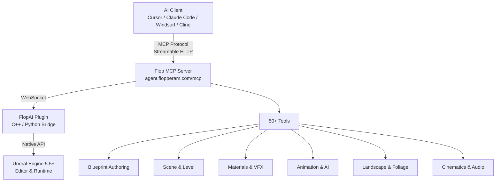
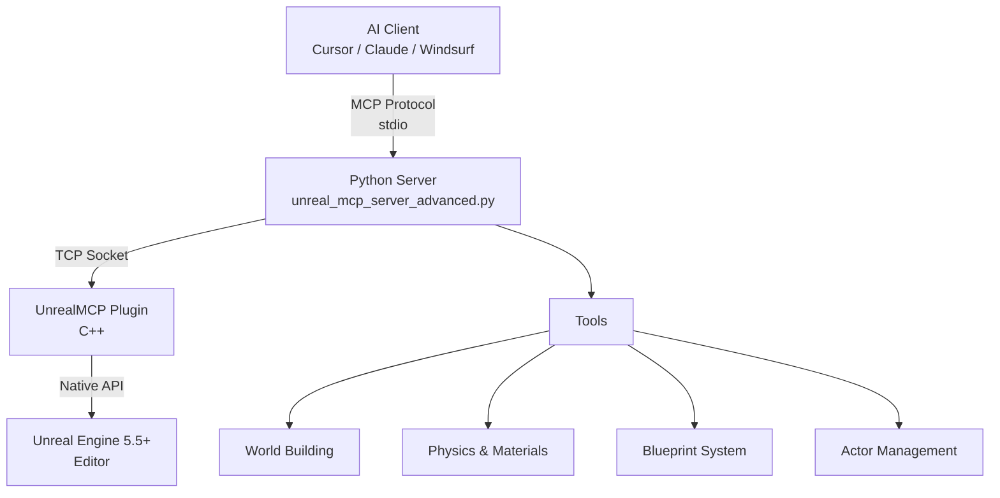

<p align="center">
  
</p>

<h1 align="center">Flopperam — Unreal Engine MCP</h1>

<p align="center">
  <strong>The most advanced MCP server for Unreal Engine.</strong><br/>
  Control a live Unreal Editor through natural language from any MCP client.
</p>

<p align="center">
  <a href="https://www.unrealengine.com/"></a>
  <a href="https://youtube.com/@flopperam"></a>
  <a href="https://discord.gg/3KNkke3rnH"></a>
  <a href="https://twitter.com/Flopperam"></a>
  <a href="https://tiktok.com/@flopperam"></a>
</p>

---

## Two Ways to Use Unreal Engine MCP

This repo contains two separate things:

| | **Hosted Flop MCP** (Recommended) | **Open-Source Local MCP** (This Repo) |
|---|---|---|
| **What** | Production MCP server hosted at `agent.flopperam.com/mcp` | Community MCP server you run locally from the `Python/` folder |
| **Tools** | **50+ tools** across 9 domains — Blueprint authoring, materials, VFX, animation, landscape, AI/BT, cinematics, PCG, and more | Basic toolset — scene manipulation, actor management, world building, and foundational Blueprint operations |
| **Blueprint support** | Full lifecycle — batched narrow tools (`bp_create`, `bp_variable`, `bp_component`, `bp_nodes`, `bp_wire`, `bp_commit`), Graph authoring, contract verification, PIE runtime testing | Foundational — `add_node`, `connect_nodes`, `create_variable`, `create_function` with 23+ node types |
| **Unreal plugin** | **FlopAI plugin** — installed separately via [flopperam.com/unreal-agent](https://www.flopperam.com/unreal-agent) | **UnrealMCP plugin** — bundled in this repo under `UnrealMCP/` |
| **Server instructions** | Rich per-tool LLM guidance, cross-tool relationship mapping, error recovery patterns | Basic tool descriptions |
| **Setup** | One URL + API key, no local dependencies | Clone repo, Python 3.12+, run server locally |
| **Works with** | Cursor, Claude Code, Windsurf, VS Code Copilot, Cline, any MCP client | Same |

> The hosted Flop MCP is a completely different, much more advanced server that shares no code with the local `Python/` server in this repo. It is actively developed with new tools shipping regularly.

---

## Hosted Flop MCP (Recommended)

One URL, one API key. No local server, no Python install. Works with **Cursor, Claude Code, Windsurf, VS Code Copilot, Cline**, and any other MCP client.

### 1. Get an API key at [flopperam.com/account](https://flopperam.com/account)

### 2. Install the FlopAI Unreal plugin — see [flopperam.com/docs](https://flopperam.com/docs) (Installation tab)

### 3. Add the config to your IDE

**Cursor** — `.cursor/mcp.json` (project) or `~/.cursor/mcp.json` (global):
```json
{
  "mcpServers": {
    "flopperam-unreal": {
      "url": "https://agent.flopperam.com/mcp",
      "headers": {
        "Authorization": "Bearer YOUR_API_KEY"
      }
    }
  }
}
```

**Claude Code** — run in your terminal:
```bash
claude mcp add -H "Authorization: Bearer YOUR_API_KEY" --transport http flopperam-unreal https://agent.flopperam.com/mcp
```

**VS Code / Copilot** — `.vscode/mcp.json`:
```json
{
  "servers": {
    "flopperam-unreal": {
      "type": "http",
      "url": "https://agent.flopperam.com/mcp",
      "headers": {
        "Authorization": "Bearer YOUR_API_KEY"
      }
    }
  }
}
```

**Cline / Local LLMs** (Ollama, LM Studio, etc.):
```json
{
  "mcpServers": {
    "flopperam-unreal": {
      "type": "streamableHttp",
      "url": "https://agent.flopperam.com/mcp",
      "headers": {
        "Authorization": "Bearer YOUR_API_KEY"
      }
    }
  }
}
```

Verify the server shows as connected in your IDE and start prompting.

### Hosted Flop MCP — Full Tool List (50+)

| **Category** | **Tools** | **Description** |
|---|---|---|
| **Blueprint Authoring** | `bp_create`, `bp_class`, `bp_variable`, `bp_component`, `bp_graph`, `bp_nodes`, `bp_wire`, `bp_input`, `bp_commit`, `bp_author`, `bp_dry_run`, `bp_skills` | Full Blueprint lifecycle — create Actor/Pawn/Character BPs, add variables/components/events/functions, wire graphs with ~40 node types, compile and verify |
| **Blueprint Inspection** | `bp_brief`, `bp_inspect`, `bp_export` | Read-only orientation — 21 targeted query ops, full GraphSpec JSON export |
| **Scene & Level** | `scene_query`, `scene_brief`, `scene_compose`, `actor_inspect`, `level_inspect`, `search_assets`, `asset_references`, `project_context` | Find actors by class/label/tag with spatial filters, declarative spawn/modify/delete, Content Browser search, dependency graphs |
| **Materials & Shading** | `material_inspect`, `material_edit` | Create materials/instances/functions/Parameter Collections, author expression graphs |
| **VFX** | `niagara_inspect`, `niagara_edit`, `niagara_script_edit`, `chaos_edit` | Niagara particle systems, reusable script modules, Geometry Collection destruction |
| **Animation** | `animation_inspect`, `animation_edit`, `animation_graph_edit`, `ik_rig_edit`, `ik_retarget` | Sequences, montages, BlendSpaces, AnimBP graph authoring, IK rigs + retargeting |
| **UMG / Widgets** | `widget_inspect`, `widget_edit` | Widget tree inspection + editing, styles, animation, MVVM, event binding |
| **AI & Abilities** | `behavior_tree`, `gas_edit`, `tag_registry_edit` | BTs, Blackboards, AI Controllers, EQS, Gameplay Abilities/Effects, Attribute Sets, Gameplay Tags |
| **Landscape & Foliage** | `landscape_inspect`, `landscape_edit`, `foliage_inspect`, `foliage_edit` | Sculpting, semantic terrain features, paint layers, heightmap import/export, foliage scattering |
| **Cinematics & Audio** | `sequencer_edit`, `metasound_edit`, `sound_asset_edit` | Level Sequences with camera cuts, MetaSound procedural audio, SoundCue graphs |
| **Procedural** | `pcg_graph_edit` | PCG graphs with generators, samplers, filters, mesh spawners |
| **Data Assets** | `asset_factory` | Enums, structs, DataTables, DataAssets, Enhanced Input bundles |
| **Editor & Diagnostics** | `editor_actions`, `editor_log`, `performance_audit`, `window_capture`, `cpp_source` | Save/undo/redo, Output Log, perf analysis, viewport screenshots, C++ source + Live Coding |
| **Runtime Verification** | `pie_test_bp`, `pie_test_scene` | PIE test harnesses with 30+ assertion types |
| **Execution** | `python_execution`, `unreal_api`, `skills` | Arbitrary Python in-editor, 15,000+ API lookups, on-demand workflow docs |

---

## Open-Source Local MCP (This Repo)

This repo includes a standalone local MCP server (`Python/`) and a C++ Unreal plugin (`UnrealMCP/`). This is a simpler, community-maintained toolset for basic Unreal Engine control — scene building, actor management, physics, and foundational Blueprint operations.

**If you want the full 50+ tool experience, use the [Hosted Flop MCP](#hosted-flop-mcp-recommended) instead.**

| **Category** | **Tools** | **Description** |
|---|---|---|
| **Blueprint Visual Scripting** | `add_node`, `connect_nodes`, `delete_node`, `set_node_property`, `create_variable`, `set_blueprint_variable_properties`, `create_function`, `add_function_input`, `add_function_output`, `delete_function`, `rename_function` | Blueprint programming with 23+ node types, variables with full property control, custom functions |
| **Blueprint Analysis** | `read_blueprint_content`, `analyze_blueprint_graph`, `get_blueprint_variable_details`, `get_blueprint_function_details` | Inspect Blueprint structure, event graphs, execution flow, variables, and functions |
| **World Building** | `create_town`, `construct_house`, `construct_mansion`, `create_tower`, `create_arch`, `create_staircase` | Build architectural structures and settlements |
| **Epic Structures** | `create_castle_fortress`, `create_suspension_bridge`, `create_aqueduct` | Massive engineering marvels and medieval fortresses |
| **Level Design** | `create_maze`, `create_pyramid`, `create_wall` | Game levels and puzzles |
| **Physics & Materials** | `spawn_physics_blueprint_actor`, `set_physics_properties`, `get_available_materials`, `apply_material_to_actor`, `apply_material_to_blueprint`, `set_mesh_material_color` | Physics simulations and material systems |
| **Blueprint System** | `create_blueprint`, `compile_blueprint`, `add_component_to_blueprint`, `set_static_mesh_properties` | Visual scripting and custom actor creation |
| **Actor Management** | `get_actors_in_level`, `find_actors_by_name`, `delete_actor`, `set_actor_transform`, `get_actor_material_info` | Scene object control and inspection |

**Full setup guide:** [LOCAL_SETUP.md](LOCAL_SETUP.md) (includes macOS compilation steps)

---

## The Flop Agent — [flopperam.com](https://flopperam.com/)

The MCP gives your IDE tools. **The Flop Agent** is a fully autonomous AI that lives inside Unreal Engine — it plans multi-step workflows, writes and executes code, recovers from errors, and iterates until the job is done.

- **Dynamic workflows** — decomposes complex requests into steps and adapts when something goes wrong
- **Unreal-native reasoning** — tuned prompts, specialized routing, deep knowledge of UE APIs and Blueprints
- **Full Blueprint creation and editing** — create new Blueprints, add variables/components/events/functions, update graph logic, compile and validate
- **World building** — creates materials, places actors, builds structures, and verifies as it goes
- **Code execution** — executes commands directly inside the editor
- **Multiple AI models** — routes to the best model per task (Opus for reasoning, Flash for lookups)
- **Chat inside Unreal** — embedded browser panel, no window switching
- **Text/image to 3D** — three quality tiers (Good, High Quality, Very High Quality)

Supports Unreal Engine 5.5, 5.6, and 5.7. Full docs at [flopperam.com/docs](https://flopperam.com/docs).


---

## See It In Action

Watch our comprehensive tutorial for complete setup and usage:
- **[Complete MCP Tutorial & Installation Guide](https://youtu.be/ct5dNJC-Hx4)** - Full walkthrough of installation, setup, and advanced usage

Check out these examples on our channel:
- **[GPT-5 vs Claude](https://youtube.com/shorts/xgoJ4d3d4-4)** - Claude and GPT-5 go head-to-head building simultaneously
- **[Advanced Metropolis Generation](https://youtube.com/shorts/6WkxCQXbCWk)** - AI generates a full metropolis with 4,000+ objects from a single prompt
- **[Advanced Maze & Mansion Generation](https://youtube.com/shorts/ArExYGpIZwI)** - Claude generates a playable maze and mansion complex

---

## Architecture

### Hosted Flop MCP

```mermaid
graph TB
    A[AI Client<br/>Cursor / Claude Code / Windsurf / Cline] -->|MCP Protocol<br/>Streamable HTTP| B[Flop MCP Server<br/>agent.flopperam.com/mcp]
    B -->|WebSocket| C[FlopAI Plugin<br/>C++ / Python Bridge]
    C -->|Native API| D[Unreal Engine 5.5+<br/>Editor & Runtime]
    
    B --> E[50+ Tools]
    E --> F[Blueprint Authoring]
    E --> G[Scene & Level]
    E --> H[Materials & VFX]
    E --> I[Animation & AI]
    E --> J[Landscape & Foliage]
    E --> K[Cinematics & Audio]
```

### Open-Source Local MCP

```mermaid
graph TB
    A[AI Client<br/>Cursor / Claude / Windsurf] -->|MCP Protocol<br/>stdio| B[Python Server<br/>unreal_mcp_server_advanced.py]
    B -->|TCP Socket| C[UnrealMCP Plugin<br/>C++]
    C -->|Native API| D[Unreal Engine 5.5+<br/>Editor]
    
    B --> E[Tools]
    E --> F[World Building]
    E --> G[Physics & Materials]
    E --> H[Blueprint System]
    E --> I[Actor Management]
```

---

## Community & Support

- **YouTube**: [youtube.com/@flopperam](https://youtube.com/@flopperam) - Tutorials, showcases, and development updates
- **Discord**: [discord.gg/3KNkke3rnH](https://discord.gg/3KNkke3rnH) - Get help, share creations, and discuss
- **Twitter/X**: [twitter.com/Flopperam](https://twitter.com/Flopperam) - Latest news and quick updates
- **TikTok**: [tiktok.com/@flopperam](https://tiktok.com/@flopperam) - Quick tips and amazing builds
- **Docs**: [flopperam.com/docs](https://flopperam.com/docs) - Full documentation

### Get Help
- **Setup Issues?** Check the [Debugging & Troubleshooting Guide](DEBUGGING.md)
- **Questions?** Ask in our [Discord server](https://discord.gg/3KNkke3rnH) for real-time support
- **Bug reports?** Open an [issue on GitHub](https://github.com/flopperam/unreal-engine-mcp/issues)
- **Feature ideas?** Join the discussion in our community channels

---

## License

MIT License — Build amazing things freely.
